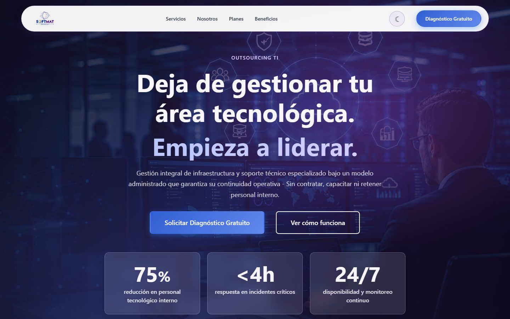
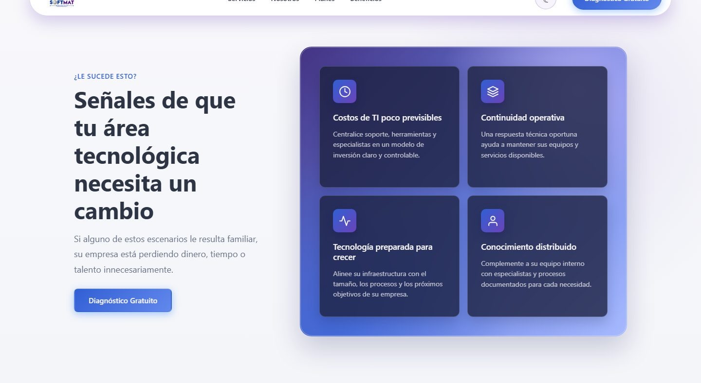
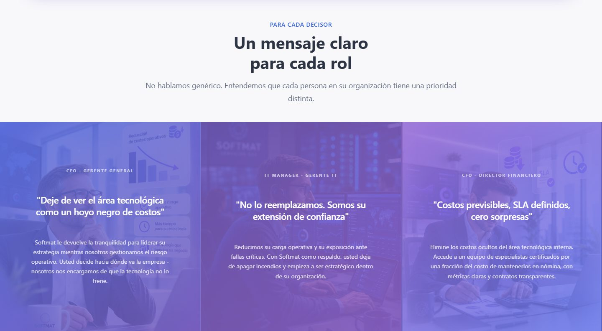
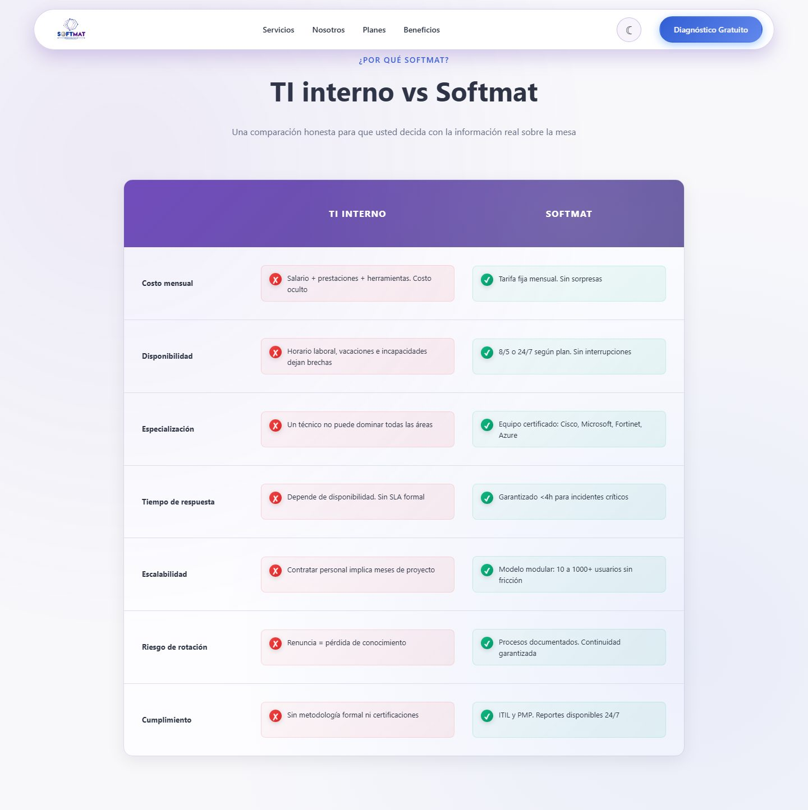
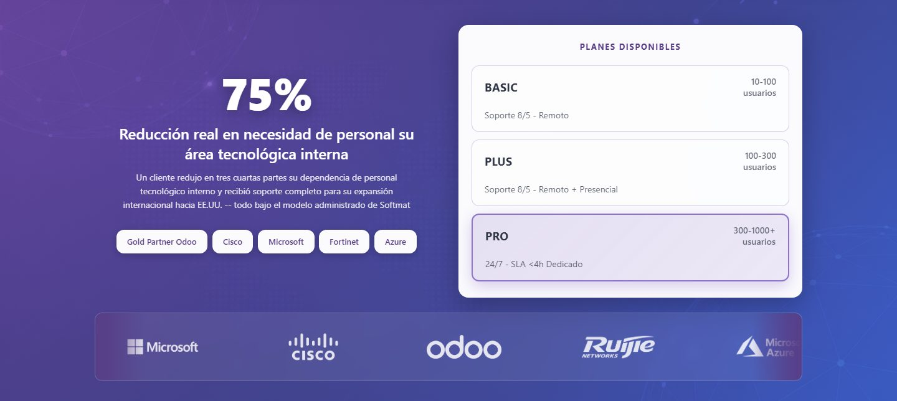
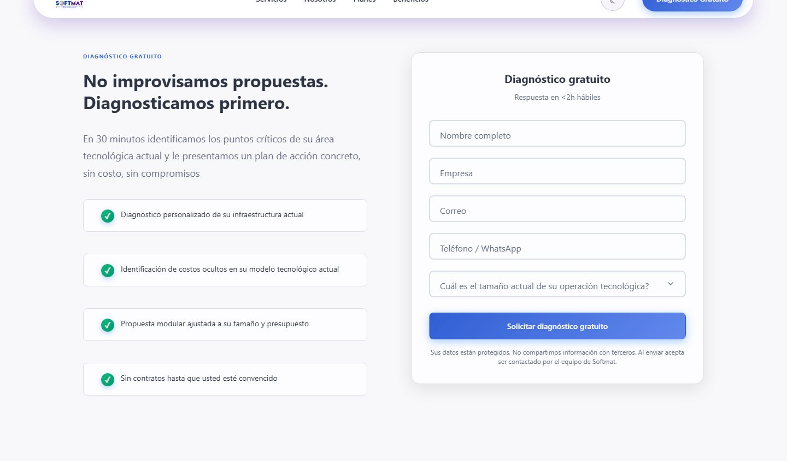
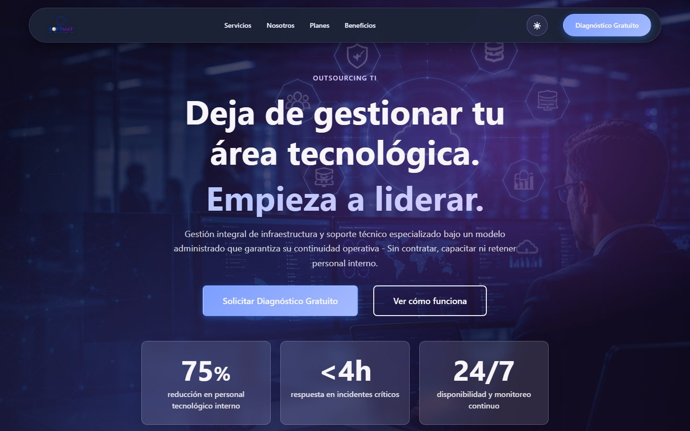
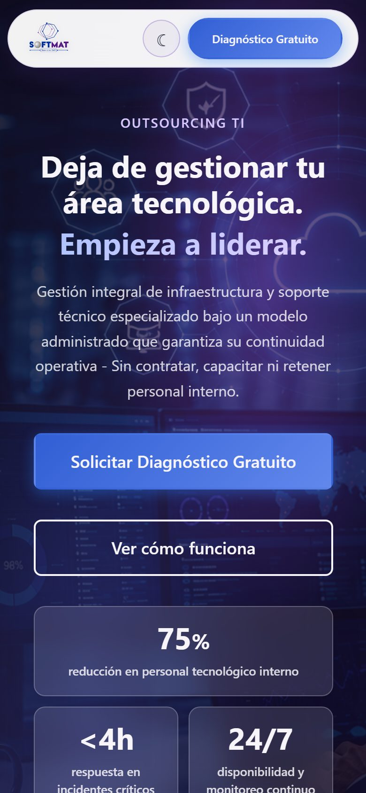

# Softmat — Landing de pauta

Página de aterrizaje para campañas publicitarias de **Softmat Servicios SAS** (outsourcing TI y gestión administrada de infraestructura).

No es el sitio corporativo. Es una URL de campaña: el visitante llega desde un anuncio, ve el problema, el mensaje por decisor y pide un diagnóstico gratuito.

Softmat opera sobre **Odoo**. Por eso esta landing está hecha solo con **HTML5, CSS3 y JavaScript vanilla**, sin frameworks ni bundlers. Así el mismo markup y los mismos assets se pueden pasar a Website / QWeb sin un puente técnico.

## Vista previa

Hero en escritorio:



Dolores del área TI y mensaje por decisor:





Comparativa y planes:





Formulario de diagnóstico (el CTA de la campaña):



Tema oscuro y vista móvil:





Para verla en local: `npx serve -l 8000` y abrir http://localhost:8000.

## Objetivo

1. Recibir tráfico de pauta (Meta, Google u otros).
2. Convertir en un lead de diagnóstico.
3. En producción, crear ese lead como **oportunidad (o lead) en el CRM de Odoo**.

Hoy el HTML es el prototipo visual y de copy. El envío real a CRM se hace al publicarla en Odoo Website.

## Por qué vanilla

Odoo Website sirve CSS y JS por `web.assets_frontend` y renderiza el HTML como plantilla QWeb (`website.layout`). React, Vue o un empaquetador obligarían a un build que el ERP no necesita.

Reglas de este repo:

- Cero dependencias de npm en runtime.
- CSS con variables, Grid y Flexbox.
- JS en un IIFE, sin módulos que Odoo no resuelva igual.
- Imágenes y logos en `assets/` para copiarlos a `static/` del módulo.

## Stack

| Capa | Archivo | Notas |
|------|---------|--------|
| Markup | `index.html` | Una sola vista, secciones con `id` para anclas |
| Estilos | `css/style.css` | ~83 KB. Tokens de marca, dark mode, breakpoints 1024 / 768 / 480 |
| Comportamiento | `js/script.js` | ~19 KB. Header, tema, scroll, animaciones, validación, modal |
| Medios | `assets/` | Logos, fondos de sección y hero |

Navegadores: Chrome 90+, Firefox 88+, Safari 14+, Edge 90+.

## Embudo

En móvil la navegación de secciones se oculta y permanece el CTA. Es intencional: en pauta se recortan salidas.

1. **Hero** — promesa y métricas.
2. **Problemas** (`#problemas`) — dolores del área TI.
3. **Decisores** (`#decisores`) — mensaje para CEO, IT Manager y CFO.
4. **Comparación** (`#comparacion`) — TI interno vs Softmat.
5. **Resultados y planes** (`#resultados`) — Basic / Plus / Pro.
6. **Diagnóstico** (`#diagnostico`) — formulario de lead.
7. **Footer** — contacto y legal.

## Paleta

- Primario: `#315fd4`
- Secundario: `#6a43b8`
- Fondo claro: `#f8f8fb`
- Fondo oscuro: `#0f1419`

El tema oscuro se guarda en `localStorage` (`softmat-theme`).

## Estructura

```
SoftMat/
├── assets/
│   ├── icons/          # Logos de partners (carrusel)
│   ├── images/         # Fondos de hero y decisores
│   └── logo/           # Marca Softmat
├── css/
│   └── style.css
├── docs/
│   └── preview/        # Capturas para este README
├── js/
│   └── script.js
├── index.html
└── README.md
```

## Cómo verla en local

No hay build. Sirve la carpeta con cualquier servidor estático (las imágenes de fondo fallan si abres el HTML como `file://` en algunos navegadores):

```bash
npx serve -l 8000
```

```bash
npx http-server
```

```bash
php -S localhost:8000
```

Abrir `http://localhost:8000`.

## Formulario (estado actual)

`#leadForm` valida en el cliente (nombre, empresa, correo, teléfono, tamaño de operación) y **simula el envío**. No llama a Odoo todavía: es el corte de la fase 1.

En producción ese bloque se sustituye por el formulario nativo de Odoo Website (`s_website_form`) con acción **Create an Opportunity**. Si en CRM está activada la opción de Leads, crea lead en lugar de oportunidad.

Campos a mapear:

| Campo HTML | Uso en CRM |
|------------|------------|
| `nombre` | Contacto / nombre |
| `empresa` | Compañía |
| `correo` | Email |
| `telefono` | Teléfono |
| `tamano` | Campo extra (10–100, 100–300, 300–1000, 1000+) |
| UTM / `gclid` / `fbclid` | Campos ocultos para atribución de pauta |

## Paso a Odoo (fase 2)

El HTML casi no se reescribe. Se envuelve y se registra.

1. Crear un módulo (por ejemplo `website_softmat_landing`).
2. Copiar CSS, JS e imágenes a `static/src/`.
3. Registrar assets:

```python
'assets': {
    'web.assets_frontend': [
        'website_softmat_landing/static/src/css/style.css',
        'website_softmat_landing/static/src/js/script.js',
    ],
},
```

4. Plantilla QWeb: contenido de `index.html` dentro de `website.layout`.
5. Reemplazar `#leadForm` por `s_website_form` → Create an Opportunity.
6. El `csrf_token` lo pone la sesión de Odoo; no va en el prototipo estático.
7. Página de gracias medible y pixel de conversión (Meta / Google).
8. Política de privacidad real: requisito de las plataformas de anuncios.

Al publicar, el mock de `submitForm` en `script.js` se recorta. Se pueden dejar tema, scroll suave, contadores e IntersectionObserver.

## Antes de encender pauta

- Comprimir PNG a WebP/AVIF. El hero debería quedar en el orden de 200 KB; los logos de partners, muy por debajo.
- Cablear el form a CRM (paso anterior).
- Teléfono y textos legales definitivos (privacidad y términos).
- Probar LCP en móvil 4G: el peso de los fondos hoy es el riesgo de CPC, no el CSS/JS.

## Licencia

© 2026 Softmat Servicios SAS. Todos los derechos reservados.
